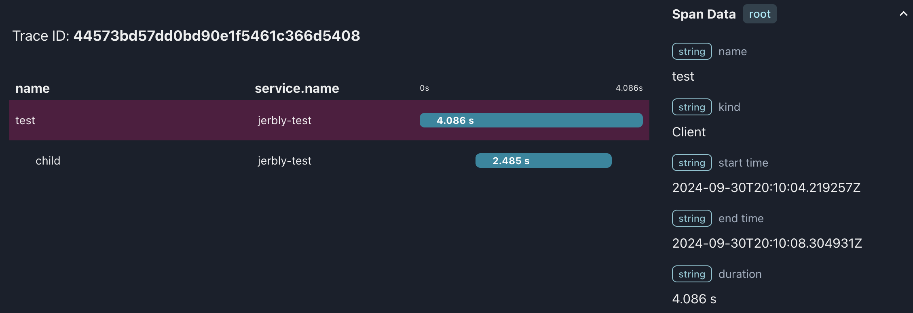

# testevents

A service to make it easier to create OpenTelemetry spans in some restricted environments. Similar to [buildevents](https://github.com/honeycombio/buildevents/tree/main) but a simple RESTful server. This is useful when you can't execute a binary but need a way to open and close OpenTelemetry spans. Low-code testing tools are a good use case.

**testevents** has an in-memory store keyed on `trace_id` and `span_id`. When you open a span you provide a TTL. If you don't close it in time, say your script crashed, it will "close" the span with an error stating that the TTL ran out.

**testevents** uses the OpenTelemetry library to create the `trace_id` and `span_id` ensuring downstream compatibility. A [`traceparent`](https://www.w3.org/TR/trace-context/#traceparent-header-field-values) is returned from `POST` operations that can be used in subsequent http calls for distributed tracing.

Spans are "closed" with a `DELETE` to `/{trace_id}/{span_id}/` - this creates the span with a calculated `duration_ms` from the "open" call.

`PATCH` to `/{trace_id}/{span_id}/` can be used to merge a set of key-values into the "open" span. Existing keys will have their values overwritten. You can change the `ttl` to extend or shorten the time to expiry. e.g. patching 10000 to a span that has been running for 34125ms will set the ttl to 44125.

## Installing

[Follow the instructions on the release page.](https://github.com/jerbly/testevents/releases) There are installers of pre-built binaries for popular OSes.

## Building

If you really want to build from source and not use a [pre-built binary release](https://github.com/jerbly/testevents/releases) then firstly you'll need a
[Rust installation](https://www.rust-lang.org/) to compile it:

```shell
git clone https://github.com/jerbly/testevents.git
cd testevents
cargo build --release
```

## Usage

### Environment variables / `.env` file entries

_(See [`example_env.txt`](example_env.txt) for an example `.env` file)_

You must provide `OTEL_EXPORTER_OTLP_ENDPOINT`. For example `http://localhost:4317`.

For Honeycomb `OTEL_EXPORTER_OTLP_ENDPOINT="https://api.honeycomb.io"`. You must also provide `HONEYCOMB_API_KEY`. An ingest key is ideal.

Provide `OTEL_SERVICE_NAME` to set the `service.name` for every span produced by **testevents** e.g. `my-test-automation`. Defaults to: `testevents`.

Provide `TESTEVENTS_PORT` to bind to an alternative from the default `3003`.

Run `test.sh` to check your setup. This will create an output like this in [otel-desktop-viewer](https://github.com/CtrlSpice/otel-desktop-viewer/tree/v0.1.4):



### Example

Make a root span:

```shell
curl -i -X POST \
  'http://127.0.0.1:3003/' \                                                        
  -H 'Content-Type: application/json' \
  -d '{"name":"test",
       "hello":"world",     
       "ttl":600000}'

HTTP/1.1 200 OK
content-type: application/json
content-length: 148
date: Thu, 11 Jul 2024 11:05:55 GMT

{"span_id":"5370f70191c4b03c","trace_id":"4c278c122e123f87036b44772861b9f4","traceparent":"00-4c278c122e123f87036b44772861b9f4-5370f70191c4b03c-01"}
```

Make a child span:

```shell
curl -i -X POST \
  'http://127.0.0.1:3003/4c278c122e123f87036b44772861b9f4/5370f70191c4b03c/' \
  -H 'Content-Type: application/json' \
  -d '{"name":"test_child", 
       "hello":"child span",
       "ttl":600000}'

HTTP/1.1 200 OK
content-type: application/json
content-length: 148
date: Thu, 11 Jul 2024 11:06:43 GMT

{"span_id":"a53924432a660874","trace_id":"4c278c122e123f87036b44772861b9f4","traceparent":"00-4c278c122e123f87036b44772861b9f4-a53924432a660874-01"}
```

Close the child span:

```shell
curl -i -X DELETE \ 
  'http://127.0.0.1:3003/4c278c122e123f87036b44772861b9f4/a53924432a660874/'  
  
HTTP/1.1 200 OK
content-type: application/json
content-length: 16
date: Thu, 11 Jul 2024 11:07:20 GMT

{"message":"OK"}
```

Close the root span:

```shell
curl -i -X DELETE \
  'http://127.0.0.1:3003/4c278c122e123f87036b44772861b9f4/5370f70191c4b03c/'

HTTP/1.1 200 OK
content-type: application/json
content-length: 16
date: Thu, 11 Jul 2024 11:07:38 GMT

{"message":"OK"}
```

Gives this trace in [Honeycomb](https://honeycomb.io):


